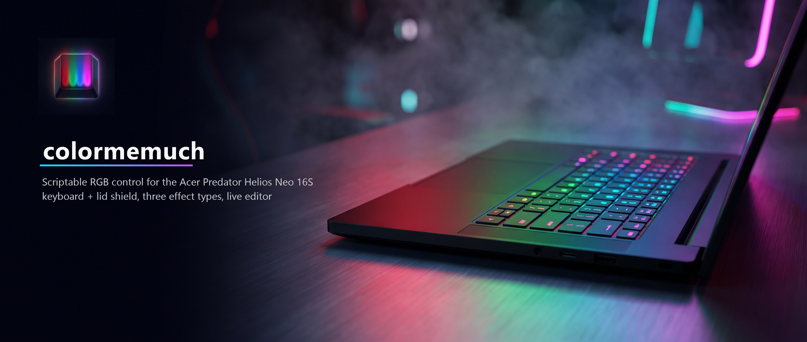

<p align="center">
  
</p>

# colormemuch

Full control of every RGB light on the **Acer Predator Helios Neo 16S AI
(PHN16S-71)** — the 4-zone keyboard backlight *and* the lid "shield" logo — from
a native Rust + egui desktop app for Windows. What PredatorSense won't expose,
this does: per-zone color, custom effects, and a scriptable path to the same
lighting hardware the vendor hides behind presets.

## What it does

**Three effect types, each wired to how the hardware actually works:**

| Type | Runs on | Scope | Cost | Editable |
|---|---|---|---|---|
| **Core** — firmware effects (Neon, Wave, Meteor, Shifting, Zoom, Twinkling…) | the keyboard controller | whole device | **zero host CPU** | color · speed · brightness |
| **Program** — built-in animations (Rainbow, Comet, Fire, Gradient, Police, Wave, Breathe) | our Rust engine | per zone | ≈0.5% CPU | code |
| **Custom** — your own palette + motion | our Rust engine | per zone | ≈0.5% CPU | **fully, in-app** |

- **Per-zone independent control on one shared clock.** Every zone commands its
  own source; two zones running the same function are phase-locked with *no
  drift*. Gang them **Link** (identical) or **Spread** (the effect travels
  across the zones) per group.
- **A live custom-effect editor.** Build an effect from a color palette and a
  motion (Static / Scroll / Bounce / Pulse / Twinkle), tune speed and
  brightness, watch a live preview, name it, save it. Custom effects persist to
  `%APPDATA%/ColorMeMuch/effects.json`.
- **Everything sticks.** Your whole setup — per-device mode, every zone's
  assignment, master brightness, Link/Spread groups — is restored on launch.
- **The lid shield too.** The Predator cover-logo LED the Linux drivers never
  mapped is a first-class device here.
- **Light on the machine.** Adaptive frame rate per effect; static zones and
  idle devices send nothing. Full animation costs ≈0.5% CPU.

## How the lighting is actually driven

The obvious route was the `AcerGamingFunction` WMI interface. **It's a dead end
for lighting** — every WMI color write is *accepted* but never reaches the LEDs;
that class governs fans, thermals, and profiles, not the backlight.

Reverse engineering (the `scripts/*.ps1` toolkit) found the real path:
**Acer bundles [OpenRGB](https://openrgb.org).** The PredatorSense package ships
`OpenRGB.exe` and runs it as a local SDK server on `127.0.0.1:6742`;
`AcerLightingService` is itself an OpenRGB *client*. The LEDs are three OpenRGB
controllers — `AcerHIDKeyboard` (4 zones), `AcerHIDCoverLogoLED` (the lid
shield), and `AcerHIDModeKeyLED`. So colormemuch speaks the **OpenRGB SDK**
directly — a small blocking `std::net` client, no elevation required.

## Install

Grab the latest `.msi` from
[Releases](https://github.com/ophiocus/colormemuch/releases) and run it. The
installer places the app in Program Files with a Start-menu shortcut; the
built-in updater surfaces new releases on each launch.

The keyboard is driven through the OpenRGB server that Acer's own PredatorSense
install already runs — no extra service to install.

## Build from source

```powershell
cargo build --release
```

For the Windows MSI (requires [WiX Toolset](https://github.com/wixtoolset/wix3/releases) on `PATH`):

```powershell
cargo install cargo-wix
cargo wix
```

## Project layout

```
.
├── Cargo.toml
├── build.rs                 # git-tag versioning + winres icon embed
├── assets/                  # logo, banner, app icon, admin manifest
├── src/
│   ├── main.rs              # eframe entry + identity constants
│   ├── app.rs               # egui shell: menu bar, panels, save hook
│   ├── ui.rs                # the RGB control screen — device panel,
│   │                        #   per-zone cards, effect editor, persistence
│   ├── openrgb.rs           # OpenRGB SDK client (enumerate, set LEDs,
│   │                        #   invoke firmware effects) — no elevation
│   ├── effects.rs           # Fx (Program/Custom), pure fn(t,n) effects,
│   │                        #   shared-clock render pipeline, Link/Spread
│   ├── library.rs           # custom-effect schema (palette + motion) +
│   │                        #   on-disk library
│   ├── rgb.rs, wmi.rs        # WMI layer — kept for fan/thermal/profile
│   │                        #   reads (NOT lighting; see above)
│   ├── config.rs            # %APPDATA% config
│   └── git_update.rs        # GitHub-releases self-updater
├── scripts/                 # the reverse-engineering toolkit that found
│                            #   the OpenRGB path (probes, traces, decoders)
└── wix/main.wxs             # MSI installer
```

## Prior art

- [JafarAkhondali/acer-predator-turbo-and-rgb-keyboard-linux-module](https://github.com/JafarAkhondali/acer-predator-turbo-and-rgb-keyboard-linux-module) — decoded the 4-zone keyboard payload
- [FelipeFMA/nekro-sense](https://github.com/FelipeFMA/nekro-sense) — the PHN16-72 sibling; confirmed the enable-flag byte
- [OpenRGB](https://openrgb.org) — the mechanism Acer ships and colormemuch talks to

## Status

✅ **Working desktop app.** Keyboard (4 zones) and the lid shield are both under
full control. Not yet built: a CLI (`colormemuch set --keyboard rainbow …`) for
scripting, a system tray with global hotkeys, and moving animation to a worker
thread so effects keep running while the window is minimized.

---

<sub>A [Tecnocrática](https://github.com/ophiocus) desktop app · Rust + egui ·
self-updating MSI · Windows.</sub>
